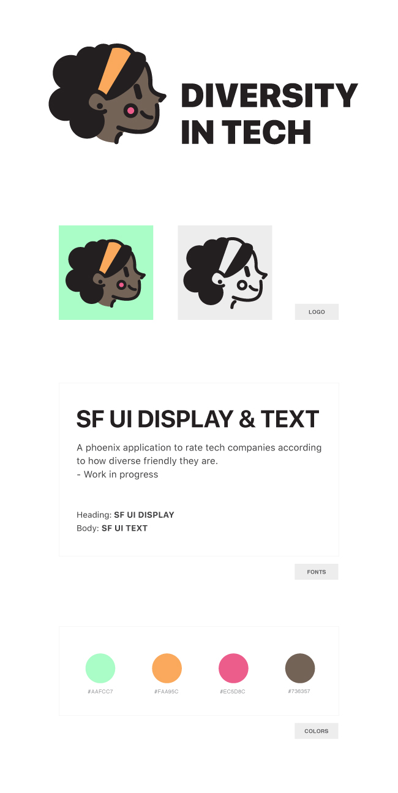

# Diversity in tech

This branding was made and donated by [Aras Atasaygın](https://twitter.com/@arasatasaygin), in his open-source project [Open Logos](https://openlogos.org). If you like this branding and its open-source projects, please consider [supporting him at Patreon](https://www.patreon.com/arasatasaygin).

----------------------------

This project is part of the [CodeBundle.io](https://github.com/codebundleio) organization.
This means that it adheres to its [core values](https://github.com/codebundleio/base/blob/master/files/VALUES.md), [code of conduct](https://github.com/codebundleio/base/blob/master/files/CODE_OF_CONDUCT.md) and
[contributing guidelines](https://github.com/codebundleio/base/blob/master/files/CONTRIBUTING.md), and uses an equivalent [license](https://github.com/codebundleio/base/blob/master/files/LICENSE).
